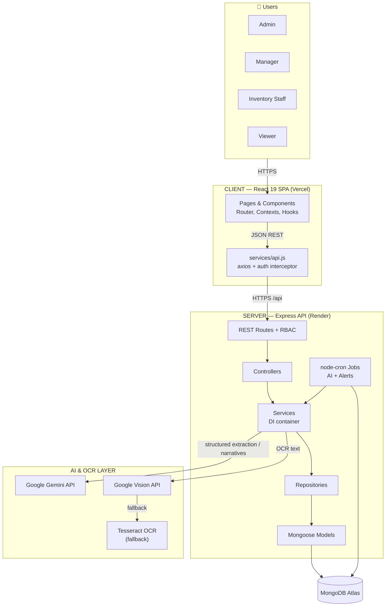

# 01 — High Level Architecture

Source of truth: `docs/02_SYSTEM_ARCHITECTURE.md`, `../model.md`

## Overview

ShelfWise AI is a client-server web application following **Enterprise Clean Architecture**:
a React SPA consuming a modular Express REST API backed by MongoDB Atlas, with external AI
(Gemini, Google Vision) and OCR fallback (Tesseract) services, plus a scheduled job layer.

## Architectural Principles

- **Dependency inversion**: `routes → controllers → services → repositories → models`.
  Controllers never touch models; services never touch HTTP (`req`/`res`).
- **Modular monolith**: one Express app, feature-scoped routers; deployable as a single service.
- **AI isolation**: AI/OCR code lives in dedicated `ai/` and `ocr/` folders with clear interfaces so
  providers can be swapped without touching business logic.
- **Scheduled processing**: node-cron jobs run AI recomputation and alert detection on cadence,
  decoupled from user request lifecycle.
- **Stateless API**: horizontal scalability — session state lives in the DB (refresh token version)
  and short-lived JWTs, not in process memory.

## Key Design Decisions

| Decision | Rationale |
|---|---|
| Refresh token in HTTP-only cookie | Mitigates XSS token theft |
| Forecasting = MA / exponential smoothing in plain JS | No heavy deps; deterministic; LLM only for narrative |
| Staged OCR output (`invoice_uploads`) | Human-in-the-loop review before DB commit |
| Clean Architecture + DI | Testability and maintainability |
