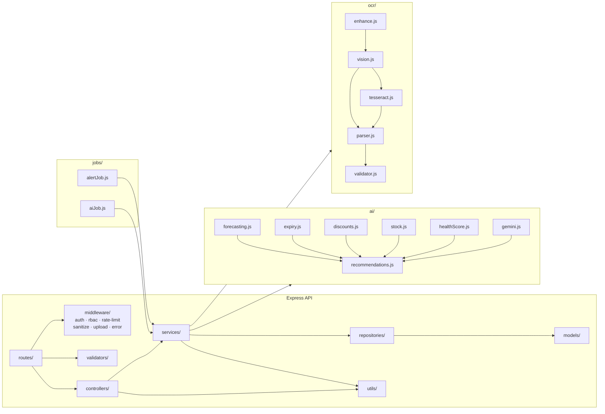
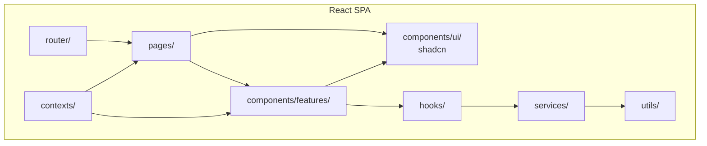

# 02 — Component Diagram

Source of truth: `docs/03_COMPONENT_DESIGN.md`

## Server Components

## Client Components

## Interface Matrix

| Server component | Exposes | Consumes |
|---|---|---|
| `routes/` | REST endpoints | controllers |
| `controllers/` | HTTP handlers | services |
| `services/` | business API | repositories, ai/, ocr/ |
| `repositories/` | persistence API | models |
| `ai/` | forecast / expiry / rec API | Gemini |
| `ocr/` | processImage / parseInvoice | Vision, Tesseract |
| `jobs/` | scheduled tasks | services |

| Client component | Exposes | Consumes |
|---|---|---|
| `router/` | guarded routes | pages |
| `pages/` | views | feature components, hooks |
| `features/` | feature UI | ui/, hooks |
| `hooks/` | data-fetch hooks | services |
| `services/` | API client | utils |
