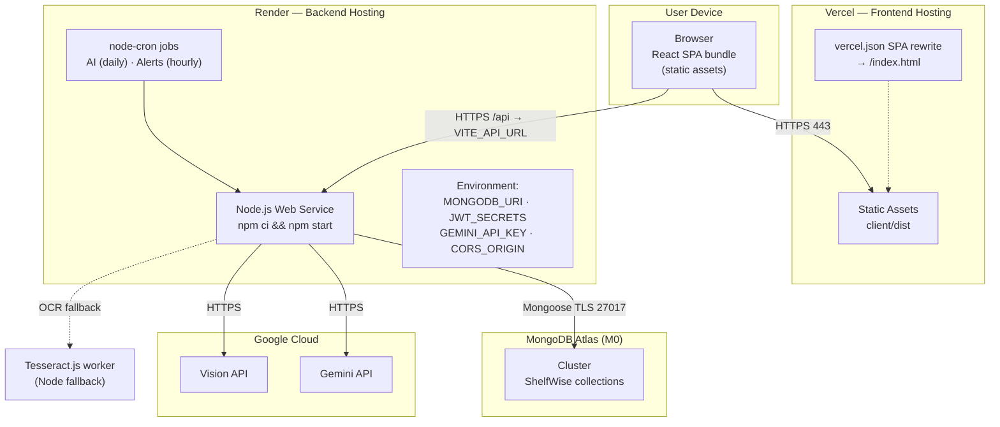
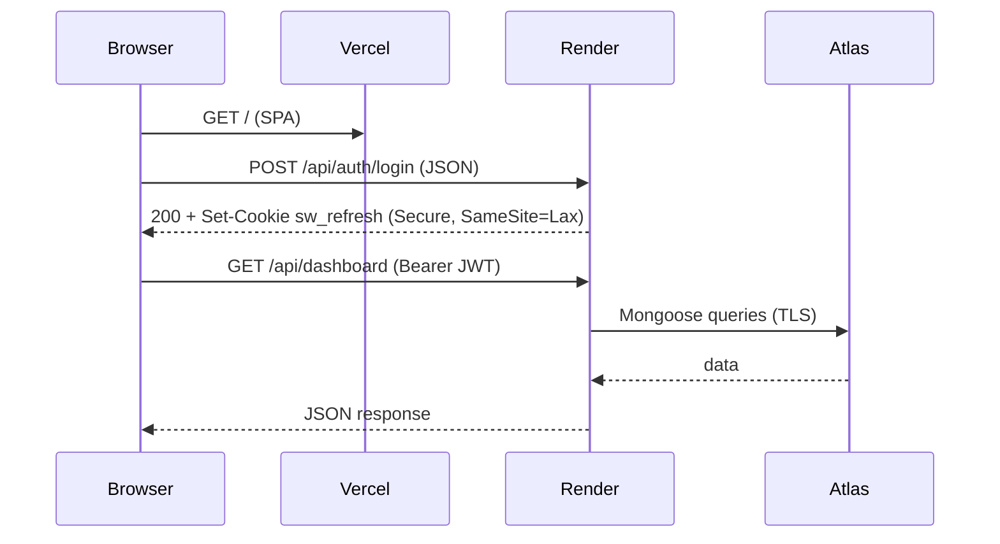

# 03 — Deployment Diagram

Source of truth: `docs/10_DEPLOYMENT.md`

Targets: **Vercel** (frontend), **Render** (backend), **MongoDB Atlas** (database),
**Google Cloud** (Gemini + Vision), **local browser** (Tesseract.js runs server-side in Node as fallback).

## Deployment Nodes

| Node | Type | Purpose | Key config |
|---|---|---|---|
| Vercel | PaaS (static) | Host React SPA | root=`client/`, build `npm ci && npm run build`, SPA rewrite |
| Render | PaaS (web service) | Host Express API + cron | root=`server/`, start `npm start`, always-on to keep cron alive |
| MongoDB Atlas | DBaaS | Persistence | M0 cluster, TLS, IP allow-list |
| Google Cloud | External API | Gemini + Vision | API keys / service account |
| Tesseract.js | In-process | OCR fallback | bundled worker, no external host |

## Network & Security

- Refresh cookie: `Secure` in production, `SameSite=Lax`, `HttpOnly`.
- CORS: allow only `CLIENT_ORIGIN`, `credentials: true`.
- Secrets: injected via platform env vars; `.env.example` committed, real `.env` ignored.

## Environments

| Env | Client origin | API URL | Notes |
|---|---|---|---|
| dev | `http://localhost:5173` | `/api` (Vite proxy → `:5000`) | local Mongo or Atlas dev cluster |
| prod | Vercel domain | Render URL | Atlas prod cluster, cron active |
