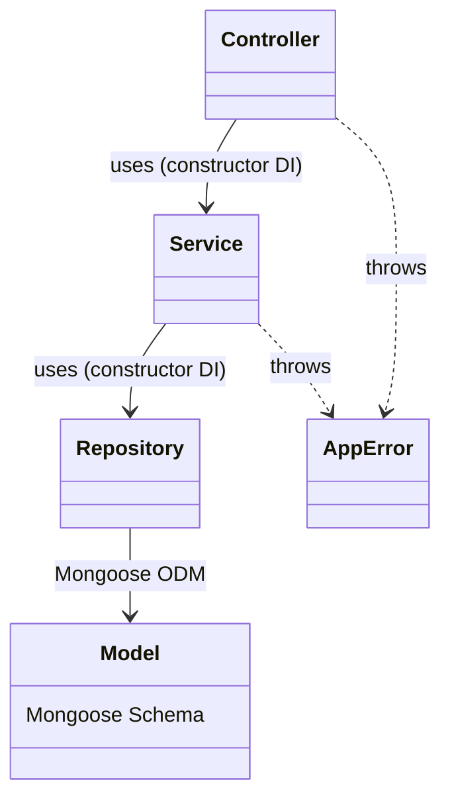
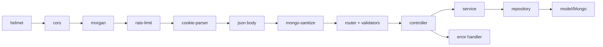
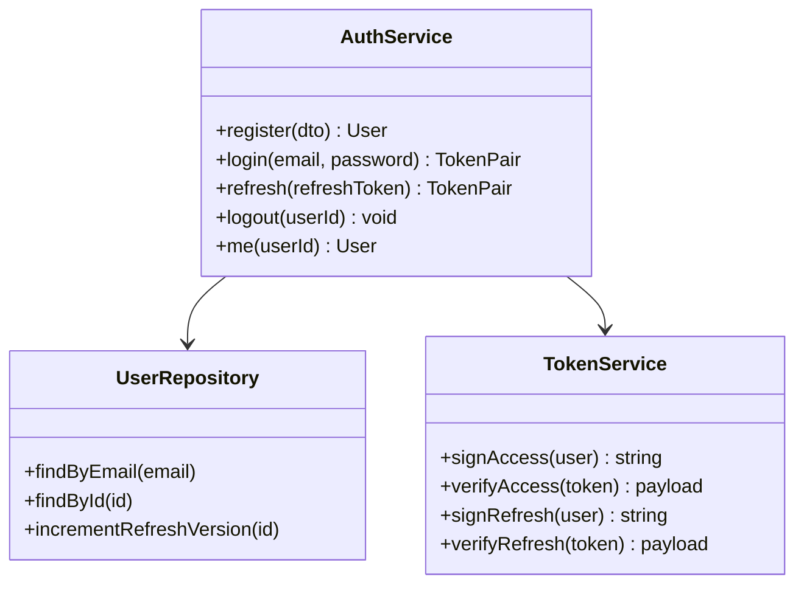
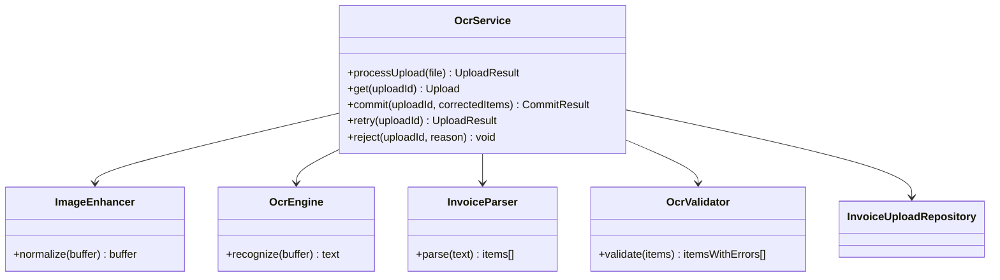
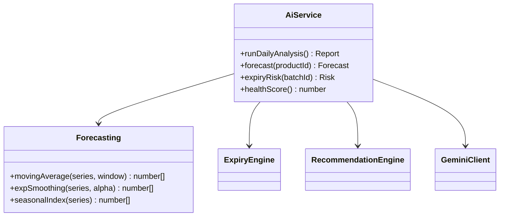
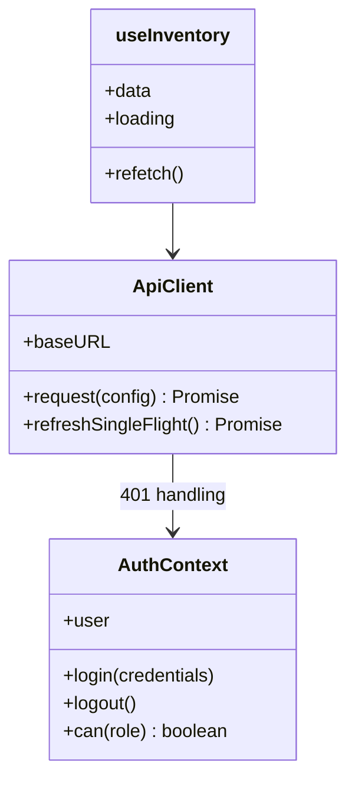

# 04 — Low Level Design

Source of truth: `docs/09_BACKEND_ARCHITECTURE.md`, `docs/08_FRONTEND_ARCHITECTURE.md`

## Server — Package & Layered Design



### Request Lifecycle



## Server — Module Design (examples)

### AuthService



### OcrService



### AiService



## Client — Key Module Design



## Data Contracts (key DTOs)

### TokenPair
```json
{ "accessToken": "jwt", "expiresIn": 900, "user": { "id": "...", "role": "manager" } }
```

### CommitResult
```json
{ "committed": 12, "productsCreated": 4, "batchesCreated": 12, "skippedDuplicates": 1 }
```

### Forecast
```json
{ "productId": "...", "horizonDays": 14, "daily": [12, 11, 13, ...], "total": 178, "confidence": "medium" }
```
