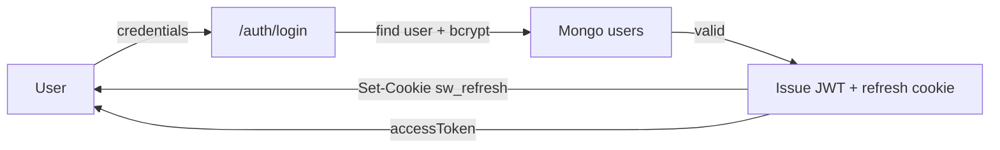
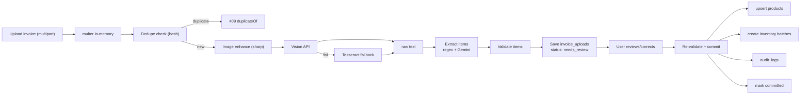
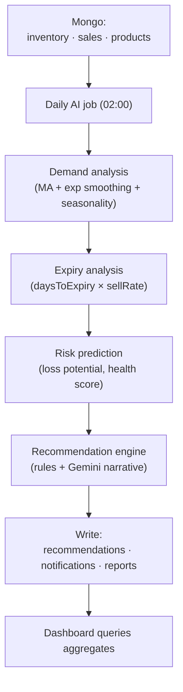
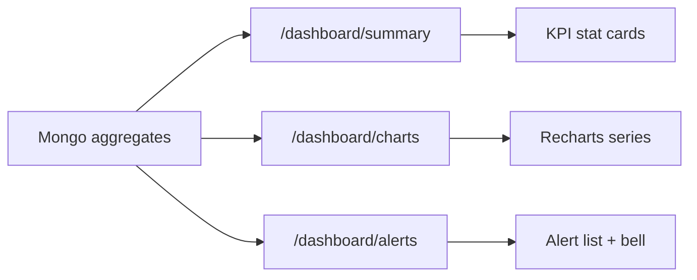
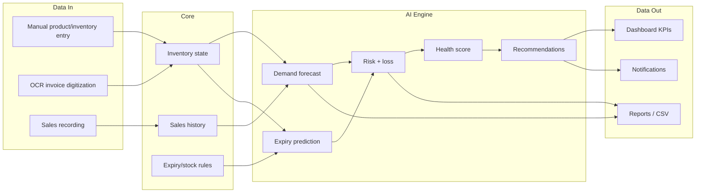

# 05 — Data Flow Diagram

Source of truth: `docs/02_SYSTEM_ARCHITECTURE.md`, `docs/07_OCR_PIPELINE.md`, `docs/06_AI_ENGINE.md`

## Primary Data Flows

### D1 — Authentication flow

### D2 — Invoice → Inventory (OCR flow)

### D3 — AI workflow

### D4 — Dashboard data flow

## Consolidated End-to-End Flow

