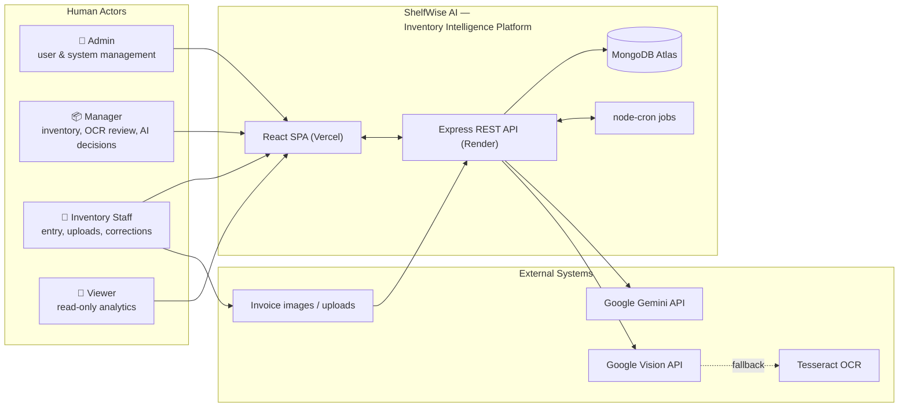
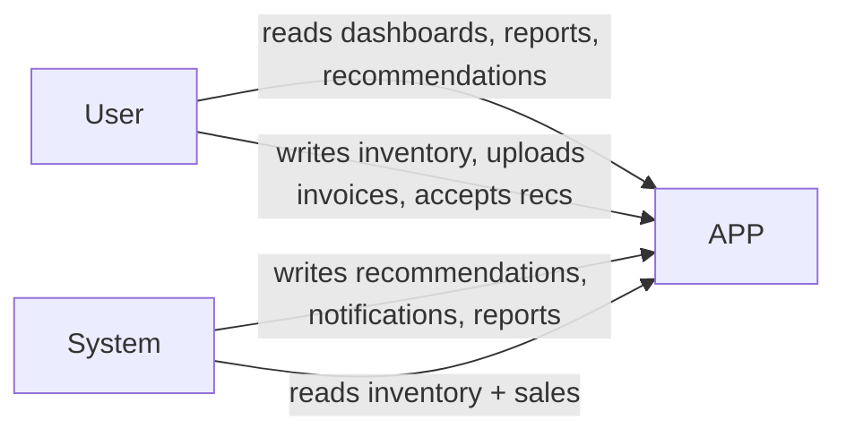

# 06 — System Context Diagram

Source of truth: `docs/01_PROJECT_OVERVIEW.md`

## Context (Level 0 — C4)

ShelfWise AI sits at the center, interacting with four human actor groups and three external systems.

## Boundary Table

| Element | Inside system? | Interaction |
|---|---|---|
| React SPA | Yes | UI consumed by all roles |
| Express API | Yes | REST interface |
| MongoDB Atlas | Yes (owned) | persistence |
| node-cron jobs | Yes | scheduled AI/alerts |
| Gemini API | No | LLM extraction/narratives |
| Vision API | No | OCR recognition |
| Tesseract.js | No (in-process) | OCR fallback |
| Invoice images | No | input artifacts |

## Role Capabilities (context)

| Role | Auth | Inventory | OCR | AI recs | Reports | Users |
|---|---|---|---|---|---|---|
| Admin | ✔ | ✔ | ✔ | ✔ | ✔ | ✔ manage |
| Manager | ✔ | ✔ | ✔ | ✔ accept/dismiss | ✔ | ✘ |
| Inventory Staff | ✔ | entry/adjust | ✔ upload+review | read | ✘ | ✘ |
| Viewer | read | read | ✘ | read | read | ✘ |

## Read-Only / Write Intent

