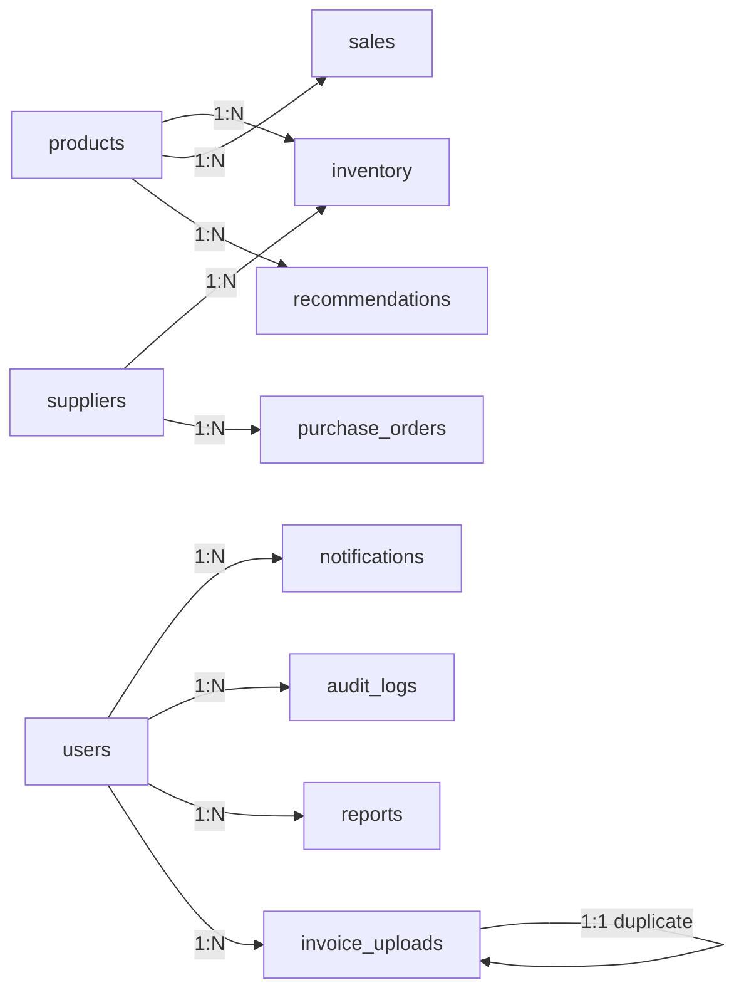
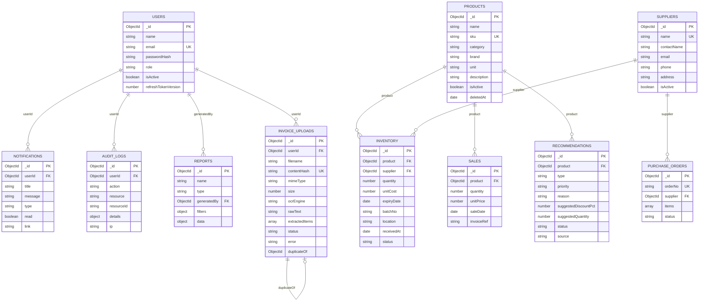

# MongoDB Design — ShelfWise AI

Source of truth: `docs/04_DATABASE_DESIGN.md`
Cluster: **MongoDB Atlas** (M0) | ODM: **Mongoose** | DB name: `shelfwise`

---

## 1. Collections

11 collections. All use `{ timestamps: true }` (adds `createdAt`, `updatedAt`).

### `users`
| Field | Type | Notes |
|---|---|---|
| `_id` | ObjectId | |
| `name` | string | required |
| `email` | string | required, unique, lowercase-indexed |
| `passwordHash` | string | required, never returned |
| `role` | string enum | `admin \| manager \| inventory_staff \| viewer` |
| `isActive` | bool | default true (soft delete flag) |
| `refreshTokenVersion` | number | default 0; bumped on logout/rotation |
| `createdAt`/`updatedAt` | date | timestamps |

### `products`
| Field | Type | Notes |
|---|---|---|
| `_id` | ObjectId | |
| `name` | string | required |
| `sku` | string | required, unique |
| `category` | string | indexed |
| `brand` | string | optional |
| `unit` | string enum | `each \| box \| pack \| kg \| g \| l \| ml` |
| `description` | string | optional |
| `isActive` | bool | soft delete flag |
| `deletedAt` | date | null when active |

### `inventory` (stock batches)
| Field | Type | Notes |
|---|---|---|
| `_id` | ObjectId | |
| `product` | ObjectId → products | required, indexed |
| `supplier` | ObjectId → suppliers | optional |
| `quantity` | number | required, ≥ 0 |
| `unitCost` | number | required, ≥ 0 |
| `expiryDate` | date | optional (null = no expiry); stored UTC |
| `batchNo` | string | required for medical/retail |
| `location` | string | optional (aisle/rack) |
| `receivedAt` | date | default now |
| `status` | string enum | `in_stock \| low \| expired` — maintained by jobs |
| `isDeleted` | bool | soft delete flag (default false) |
| `deletedAt` | date | |

Unique compound: `(product, batchNo, expiryDate)` — blocks duplicate batches.

### `suppliers`
| Field | Type | Notes |
|---|---|---|
| `_id` | ObjectId | |
| `name` | string | required, unique |
| `contactName` | string | optional |
| `email` | string | optional |
| `phone` | string | optional |
| `address` | string | optional |
| `isActive` | bool | soft delete flag |

### `sales`
| Field | Type | Notes |
|---|---|---|
| `_id` | ObjectId | |
| `product` | ObjectId → products | required, indexed |
| `quantity` | number | required, ≥ 1 |
| `unitPrice` | number | required, ≥ 0 |
| `saleDate` | date | required, UTC, indexed |
| `invoiceRef` | string | optional external reference |

### `purchase_orders`
| Field | Type | Notes |
|---|---|---|
| `_id` | ObjectId | |
| `orderNo` | string | required, unique |
| `supplier` | ObjectId → suppliers | optional |
| `items` | subdocument array | `[{ product, quantity, unitCost, expectedDate }]` |
| `status` | string enum | `draft \| placed \| received \| cancelled` |
| `isDeleted` | bool | soft delete flag |

### `recommendations`
| Field | Type | Notes |
|---|---|---|
| `_id` | ObjectId | |
| `product` | ObjectId → products | optional |
| `type` | string enum | `discount \| restock \| dispose \| donate \| reprice` |
| `priority` | string enum | `high \| medium \| low` |
| `reason` | string | rule or LLM narrative |
| `suggestedDiscountPct` | number | 0–70 |
| `suggestedQuantity` | number | optional |
| `expectedOutcome` | mixed | number/string |
| `status` | string enum | `open \| accepted \| dismissed` |
| `source` | string enum | `ai \| rule` |
| `aiRunId` | string | links to the AI job run |

### `notifications`
| Field | Type | Notes |
|---|---|---|
| `_id` | ObjectId | |
| `userId` | ObjectId → users | required, indexed |
| `title` | string | required |
| `message` | string | required |
| `type` | string enum | `info \| warning \| danger` |
| `read` | bool | default false |
| `link` | string | optional route target |
| TTL | — | auto-purge after 30 days via index on `createdAt` |

### `audit_logs`
| Field | Type | Notes |
|---|---|---|
| `_id` | ObjectId | |
| `userId` | ObjectId → users | optional (system jobs = null) |
| `action` | string | `login \| logout \| create \| update \| delete \| adjust \| commit \| reject` |
| `resource` | string | `inventory \| product \| user \| ...` |
| `resourceId` | ObjectId/string | optional |
| `details` | object | before/after diff, reason |
| `ip` | string | optional |
| `createdAt` | date | immutable; TTL 180 days |

### `reports`
| Field | Type | Notes |
|---|---|---|
| `_id` | ObjectId | |
| `name` | string | required |
| `type` | string enum | `inventory \| expiry \| sales \| loss \| demand` |
| `generatedBy` | ObjectId → users | |
| `filters` | object | applied filters snapshot |
| `data` | object | capped at 1000 rows embedded |
| `createdAt` | date | |

### `invoice_uploads`
| Field | Type | Notes |
|---|---|---|
| `_id` | ObjectId | |
| `userId` | ObjectId → users | required |
| `filename` | string | stored name |
| `contentHash` | string | dedupe key, unique |
| `mimeType` / `size` | string/number | multer metadata |
| `ocrEngine` | string enum | `vision \| tesseract` |
| `rawText` | string | OCR output |
| `extractedItems` | subdocument array | `[{ productName, sku, quantity, unitCost, expiryDate, lineTotal, errors[] }]` |
| `status` | string enum | `processing \| needs_review \| committed \| failed` |
| `error` | string | optional |
| `duplicateOf` | ObjectId → invoice_uploads | when duplicate |

---

## 2. Relationships

MongoDB is document-oriented — relations are **logical references** (manual joins via `$lookup` or Mongoose `.populate()`), max one level deep.

| Parent | Child | Cardinality | Relation kind |
|---|---|---|---|
| `products` | `inventory` | 1:N | `product` ref |
| `suppliers` | `inventory` | 1:N | `supplier` ref |
| `products` | `sales` | 1:N | `product` ref |
| `suppliers` | `purchase_orders` | 1:N | `supplier` ref |
| `products` | `recommendations` | 1:N | `product` ref |
| `users` | `notifications` | 1:N | `userId` ref |
| `users` | `audit_logs` | 1:N | `userId` ref |
| `users` | `reports` | 1:N | `generatedBy` ref |
| `users` | `invoice_uploads` | 1:N | `userId` ref |
| `invoice_uploads` | `invoice_uploads` | 1:1 | `duplicateOf` self-ref |

Embedding rule: `purchase_orders.items` and `invoice_uploads.extractedItems` are **embedded** (bounded arrays, accessed with parent). All other relations are referenced.

---

## 3. Indexes

| Collection | Index | Type | Purpose |
|---|---|---|---|
| `users` | `email` | unique | login lookup |
| `users` | `role` | single | role filtering |
| `products` | `sku` | unique | dedupe + lookup |
| `products` | `name` | text | search |
| `products` | `category` | single | filtering |
| `inventory` | `(product, batchNo, expiryDate)` | unique compound | duplicate batch prevention |
| `inventory` | `expiryDate` | single | expiry queries/notifications |
| `inventory` | `status` | single | low/expired scans |
| `inventory` | `product` | single | join + forecasts |
| `sales` | `(product, saleDate)` | compound | forecasting window |
| `sales` | `saleDate` | single | date-range reports |
| `purchase_orders` | `orderNo` | unique | invoice/PO dedupe |
| `purchase_orders` | `status` | single | pipeline view |
| `recommendations` | `(status, priority, createdAt)` | compound | dashboard queue |
| `recommendations` | `product` | single | per-product recs |
| `notifications` | `(userId, read)` | compound | unread badge |
| `notifications` | `createdAt` | TTL (30d) | auto-purge |
| `audit_logs` | `(resource, resourceId, createdAt)` | compound | history lookup |
| `audit_logs` | `createdAt` | TTL (180d) | retention |
| `invoice_uploads` | `contentHash` | unique | duplicate detection |
| `invoice_uploads` | `(userId, status, createdAt)` | compound | user upload history |

Notes:
- TTL indexes require a BSON date field and remove docs at scheduled time.
- Compound index order follows equality → range → sort.

---

## 4. Validation

Two layers: **application-level** (express-validator + service rules) and **schema-level** (Mongoose + optional MongoDB JSON Schema).

### Application validation rules
| Entity | Rules |
|---|---|
| User | email valid; password ≥ 8 chars; role in enum; isActive bool |
| Product | name, sku required; sku unique; unit in enum |
| Inventory | quantity ≥ 0; unitCost ≥ 0; expiryDate valid & in future (when provided); unique `(product, batchNo, expiryDate)` |
| Sale | quantity ≥ 1; unitPrice ≥ 0; saleDate not in future |
| PurchaseOrder | orderNo unique; items non-empty; quantity ≥ 1 |
| Recommendation | type/priority/status/source in enums; suggestedDiscountPct 0–70 |
| InvoiceUpload | mime in allow-list; size ≤ 10 MB; contentHash unique |

### Schema-level (Mongoose schema options)
- `enum`, `required`, `min/max` on numbers, `trim`/`lowercase` on strings.
- `select: false` on `passwordHash`.
- `expires` (TTL) on notification/audit `createdAt`.
- Optional MongoDB `validator` JSON Schema for defense-in-depth on: `users.role`, `inventory.status`, `purchase_orders.status`, `recommendations.status/type`, numeric bounds.

### Invariant guards (service layer)
- Stock adjust resulting in negative → rejected unless `allowNegative=false`.
- Cannot delete an inventory batch with pending sales refs — mark `expired` instead.
- Commit writes within a Mongo **transaction** (multi-doc `products` + `inventory` + `invoice_uploads`).

---

## 5. ER Diagram

---

## 6. Audit Strategy

- **Purpose**: compliance trail and traceability for sensitive operations; supports the "multiple users editing" edge case by recording before/after.

### What is audited
| Action | Resource | Details captured |
|---|---|---|
| login / logout / failed login | user | email, IP, success/fail |
| create / update / delete | product, inventory, supplier, user, PO | before → after diff, actor, IP |
| stock adjust | inventory | old/new quantity, reason |
| OCR commit / reject | invoice_uploads | item counts, error reason |
| recommendation accept/dismiss | recommendations | actor, old status → new |
| role change | user | old role → new role |

### Model
- `audit_logs` is **append-only**: no update/delete via API; TTL 180 days then auto-purged.
- Writes happen **inside the same transaction** as the business write where possible.
- `userId = null` for system/cron actions (`source: 'cron'` noted in `details`).
- `ip` captured from request; `details` stored as a plain object (max ~4 KB).

### Access
- Admin-only read endpoint `GET /api/audit-logs` with filters (resource, action, date range).
- No edit/delete endpoints for audit logs.

---

## 7. Soft Delete Strategy

| Collection | Strategy | Mechanism |
|---|---|---|
| `users` | Soft delete | `isActive: false` — prevents login; keeps history/refs intact |
| `products` | Soft delete | `isActive: false` + `deletedAt` — hides from UI, preserves sales/inventory refs; admin can restore |
| `suppliers` | Soft delete | `isActive: false` |
| `inventory` | Soft delete | `isDeleted: true` + `deletedAt` — batch removed from stock counts but kept for audit |
| `purchase_orders` | Status-based | marked `cancelled`, never hard-deleted except drafts |
| `notifications` | Hard delete | TTL/read purge; ephemeral |
| `audit_logs` | Hard delete | TTL only |
| `sales`, `reports`, `recommendations`, `invoice_uploads` | Hard delete (admin) | immutable records; `recommendations` dismissed rather than deleted |

Rules:
- Soft-deleted rows excluded from all default queries via repository-level filters (`isActive: true` / `isDeleted: false`).
- **Do not** reuse SKUs or emails of soft-deleted records (uniqueness retained) — new entries must differ or be a restore.
- Restore action is itself audit-logged.

---

## 8. Backup Strategy

### Atlas-native
- **MongoDB Atlas backups**: enable Continuous Cloud Backup / PITR (paid tiers) or the scheduled backups for M10+.
- For the free M0 tier: use `mongodump`/`mongorestore` via Atlas API or `Atlas CLI`.

### Scripted (repo `scripts/`)
| Script | Cadence | Notes |
|---|---|---|
| `scripts/backup.js` | nightly (server cron or external) | `mongodump` → gzip → upload to private bucket (S3/GCS) |
| `scripts/restore.js` | on-demand | restore from chosen snapshot to a staging cluster, never to prod directly |
| `scripts/verify-backup.js` | after backup | reads sample docs + counts from restored dump |

### Backup scope
- All 11 collections. Exclude nothing; `audit_logs` and `reports` retained per TTL within DB.
- Dump metadata file: DB version, timestamp, collection counts, checksum.

### Recovery
- RPO: 24 h (nightly) or near-zero with Atlas PITR.
- RTO: ≤ 30 min (restore to staging → promote).
- Drill: quarterly restore test; document result in `docs/` runbook.

### Data protection notes
- `passwordHash` is hashed (bcrypt) — backup exposure still hashes, but bucket is private + encrypted at rest.
- Credentials (Gemini/Vision/DB URI) never stored in DB or backups; only env vars.
- Backups encrypted (TLS in transit, SSE/CMK at rest on the object store).
